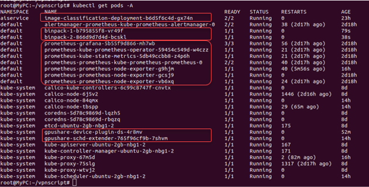
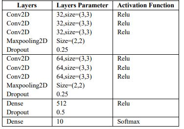

# AIaaS
Distributed system course project

Lecturer: Dr. Hamid Reza Faragardi

Project developer: Ali Yaghounbian - Muhammad Valinezhad
-----
## Kubernetes cluster pods

+ Image-classification-deployment: CNN-based image classifier is implemented in Python library sk-learn and Keras with the backend of Tensorflow. Layer-wise architectural details of this model are shown in the following table.

RESTful API for this application is implemented by FastAPI and uvicorn.

This application contains Exporter to retrive metrics data and transfer captured data into a Prometheus ingestible format.

+ Binpack: Simple test app to show GPU sharing and GPU scheduling.

+ Prometheus and Grafana: To collect and store metrics data and create dashboards and charts. In this project, Prometheus-operator was installed to simplify and automate the configuration of a Prometheus-based monitoring stack for Kubernetes clusters.

+ Gpushare-device-plugin: It uses the Device Plugin mechanism, it is responsible for the allocation of the GPU device according to the decision of the GPU Share Scheduler Extender recorded on the Pod Spec Annotation and run GPU sharing enabled containers in Kubernetes cluster.

+ Gpushare-sched-extender: It uses the Kubernetes scheduler extender mechanism, it is responsible for determining whether a single GPU device on the node can provide enough GPU Memory when the global scheduler Filter and Bind, and records the GPU allocation result to the Pod Spec Annotation for subsequent filter at the time of Bind.