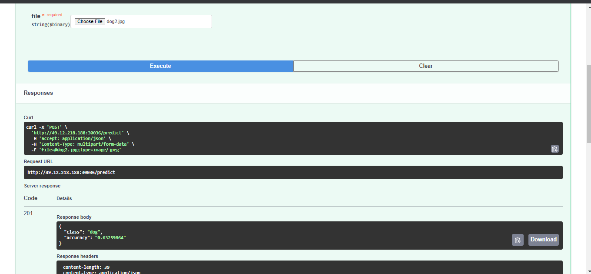

# Image Classification application and its exporter.
The source code of this application and its exporter are available in this repository. 

+ Build docker image
This step is not neccessary becuase docker images are available in my docker repository.
```bash
$ docker build -t image_classification:0.4 .
$ cd exporter
$ docker build -t exporter:0.2 .
```

+ Deploy on kubernetes
```bash
$ cd k8s
$ kubectl apply -f Namespace.yaml
$ kubectl apply -f Deployment.yaml
$ kubectl apply -f Service.yaml
$ kubectl apply -f ServiceMonitor.yaml
```
Note: ServiceMonitor is a custom resource in Kubernetes that Prometheus Operator introduced, So before deploying ServiceMonitor, you should install Prometheus Operator. please refer to PrometheusOpt_Grafana.md

+ Validation
```bash
$ kubectl get servicemonitor -A
aiservice   image-classification-exporter-monitor                35s
default     prometheus-grafana                                   33h
default     prometheus-kube-prometheus-alertmanager              33h
default     prometheus-kube-prometheus-apiserver                 33h
default     prometheus-kube-prometheus-coredns                   33h
default     prometheus-kube-prometheus-kube-controller-manager   33h
default     prometheus-kube-prometheus-kube-etcd                 33h
default     prometheus-kube-prometheus-kube-proxy                33h
default     prometheus-kube-prometheus-kube-scheduler            33h
default     prometheus-kube-prometheus-kubelet                   33h
default     prometheus-kube-prometheus-operator                  33h
default     prometheus-kube-prometheus-prometheus                33h
default     prometheus-kube-state-metrics                        33h
default     prometheus-prometheus-node-exporter                  33h

$ kubectl get pods -A
NAMESPACE     NAME                                                     READY   STATUS        RESTARTS          AGE
aiservice     image-classification-deployment-b6d5f6c4d-gx74n          2/2     Running       0                 50s
```


+ Open FastAPI documentation page

URL: http://$IP_Address:30036/docs

+ Test:


