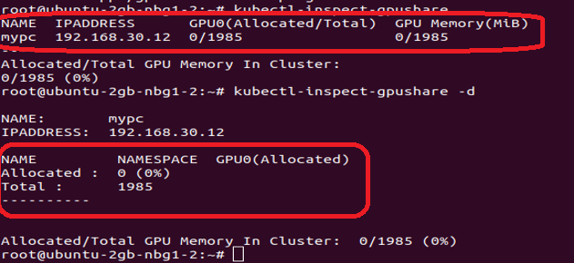
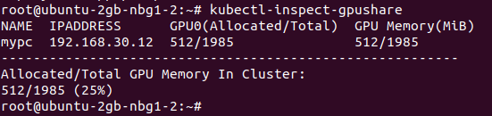
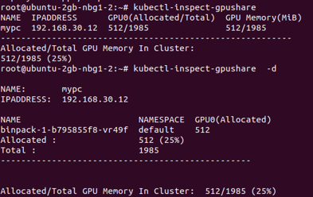
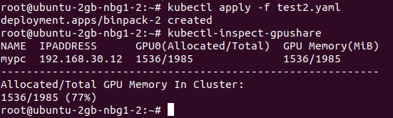
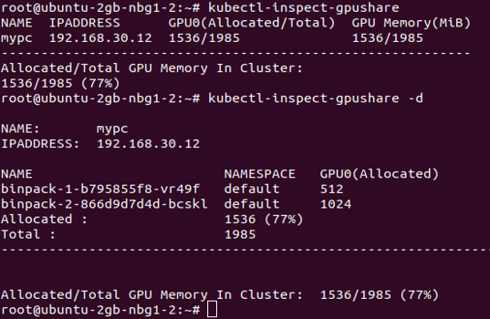

# GPU Sharing Scheduler Extender in Kubernetes
[Reference](https://github.com/AliyunContainerService/gpushare-scheduler-extender)

[Installation Guide](https://github.com/AliyunContainerService/gpushare-scheduler-extender/blob/master/docs/install.md)

[Design document](https://github.com/AliyunContainerService/gpushare-scheduler-extender/blob/master/docs/designs/designs.md)

Note: Your master node should have node-role.kubernetes.io/master taint

Note: If you want to use MiB instead of Gib, you should change the memory-unit into MiB in device-plugin-ds.yaml

+ Test: Test1 and Test2 require 512 Mib and 1024 Mib of GPU memory respectively.

Before Test1 and Test2:

Test1 is running:

Test1 and Test2 are running:

